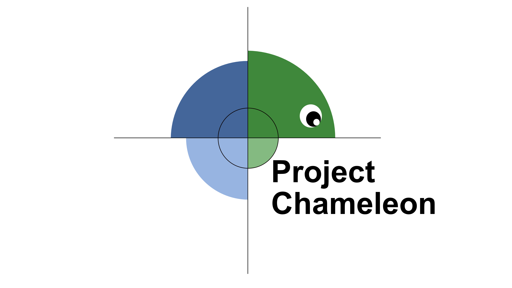

.. Project Chameleon documentation master file, created by
   sphinx-quickstart on Fri May 31 11:47:08 2024.
   You can adapt this file completely to your liking, but it should at least
   contain the root `toctree` directive.

=============================================
Project Chameleon
=============================================

**Project Chameleon** provides data processing tools for files commonly found in materials science research. More information is available on the introduction page for users. Project Chameleon is maintained as part of the **Platform for the Accelerated Research, Analysis, and Discovery of Interfaced Materials (PARADIM)**, funded by the **National Science Foundation**.

Project Chameleon is free and open source. It can be found on `Github <https://github.com/paradimdata/project_chameleon>`. It can also be found as a docker image in the Github repository.

.. image:: ../../PARADIM_LOGO.png
   :width: 400

---

.. toctree::
   :maxdepth: 2
   :caption: Introduction to Chameleon

   introduction/introduction
   introduction/installing_chameleon
 
.. toctree::
   :maxdepth: 2
   :caption: Data Types

   data/arpes
   data/brukerrawconverter
   data/hs2converter
   data/mbeparser
   data/non4dstem
   data/ppmsmpms
   data/rheedconverter
   data/jeolsem

.. toctree::
   :maxdepth: 2
   :caption: Existing Implementation

   implementation/docker
   implementation/plugin

==================
Indices and tables
==================

* :ref:`genindex`
* :ref:`modindex`
* :ref:`search`
