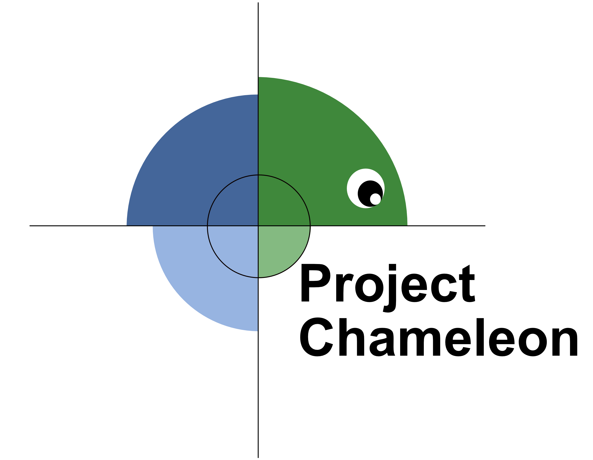

.. Project Chameleon documentation master file, created by
   sphinx-quickstart on Fri May 31 11:47:08 2024.
   You can adapt this file completely to your liking, but it should at least
   contain the root `toctree` directive.

=============================================
Project Chameleon
=============================================

Welcome to **Project Chameleon** — a software package designed for data processing in materials science research.

Project Chameleon provides a collection of functions to streamline research workflows by enabling:
- Fast extraction of data from files
- Efficient data plotting
- Conversion of data formats to more accessible and standardized formats

These functions are tailored to specific data formats produced by certain brands of scientific tools. Because these formats can vary significantly between manufacturers, some functions may not work correctly with unsupported data types. Each function’s documentation specifies the expected input file format, helping users determine its compatibility with their data.

.. toctree::
   :maxdepth: 2
   :caption: Introduction to Chameleon

   introduction/introduction
   introduction/installing_chameleon
 
.. toctree::
   :maxdepth: 2
   :caption: Data Types

   data/arpes
   data/brukerrawconverter
   data/hs2converter
   data/mbeparser
   data/non4dstem
   data/ppmsmpms
   data/rheedconverter
   data/jeolsem

.. toctree::
   :maxdepth: 2
   :caption: Existing Implementation

   implementation/docker
   implementation/plugin

---

Project Chameleon is written and maintained by **Peter Cauchy** and is part of the research conducted by the **Platform for the Accelerated Research, Analysis, and Discovery of Interfaced Materials (PARADIM)**.

.. image:: ../../PARADIM_LOGO.png
   :width: 400

Indices and tables
==================

* :ref:`genindex`
* :ref:`modindex`
* :ref:`search`
